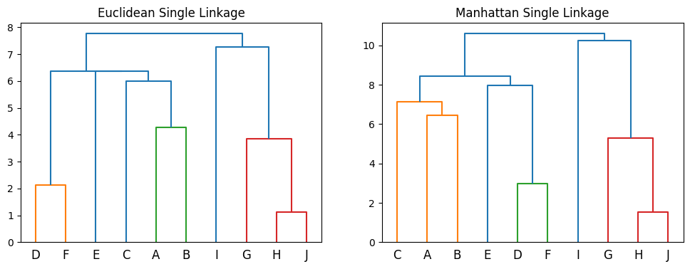

### GE2324 Assignment1
LIU Hengche 57854329

#### Q1:
**(a)**:
```
Formula used: d(p, q) = square root of ((q1 - p1)^2 + (q2 - p2)^2)
Euclidean Distance Matrix:
      A     B     C     D     E     F     G     H     I     J
A  0.00  1.70  3.11  6.19  4.03  7.05  5.80  6.53  8.63  6.96
B  1.70  0.00  3.67  4.49  2.47  5.35  5.28  5.60  7.20  6.00
C  3.11  3.67  0.00  7.03  4.51  7.78  3.53  4.84  7.86  5.28
D  6.19  4.49  7.03  0.00  2.52  0.86  6.08  5.12  4.16  5.23
E  4.03  2.47  4.51  2.52  0.00  3.30  4.17  3.81  4.75  4.11
F  7.05  5.35  7.78  0.86  3.30  0.00  6.55  5.42  3.86  5.46
G  5.80  5.28  3.53  6.08  4.17  6.55  0.00  1.62  5.03  1.97
H  6.53  5.60  4.84  5.12  3.81  5.42  1.62  0.00  3.42  0.45
I  8.63  7.20  7.86  4.16  4.75  3.86  5.03  3.42  0.00  3.14
J  6.96  6.00  5.28  5.23  4.11  5.46  1.97  0.45  3.14  0.00
```
**(b)**:
```
Manhattan Distance Matrix:
      A    B     C    D    E    F    G    H     I    J
A   0.0  2.3   4.3  8.5  5.7  9.7  6.0  7.7  11.9  8.3
B   2.3  0.0   5.0  6.2  3.4  7.4  6.7  5.8   9.6  6.0
C   4.3  5.0   0.0  7.6  4.8  8.8  4.7  6.8  11.0  7.4
D   8.5  6.2   7.6  0.0  2.8  1.2  8.1  7.2   4.8  7.4
E   5.7  3.4   4.8  2.8  0.0  4.0  5.9  5.0   6.2  5.2
F   9.7  7.4   8.8  1.2  4.0  0.0  8.3  7.4   5.0  7.6
G   6.0  6.7   4.7  8.1  5.9  8.3  0.0  2.1   6.3  2.7
H   7.7  5.8   6.8  7.2  5.0  7.4  2.1  0.0   4.2  0.6
I  11.9  9.6  11.0  4.8  6.2  5.0  6.3  4.2   0.0  3.6
J   8.3  6.0   7.4  7.4  5.2  7.6  2.7  0.6   3.6  0.0
Formula used: d(p, q) = absolute value of (q1 - p1) + absolute value of (q2 - p2)
```

**(c)**
```
Detailed steps of hierarchical clustering (single - linkage) using Euclidean distance:
Step 1:
  Merged clusters: (7, 9)
  Distance between them: 0.45
  New cluster formed: [7, 9]
Step 2:
  Merged clusters: (3, 5)
  Distance between them: 0.86
  New cluster formed: [3, 5]
Step 3:
  Merged clusters: (4, 6)
  Distance between them: 1.62
  New cluster formed: [6, 7, 9]
Step 4:
  Merged clusters: (0, 1)
  Distance between them: 1.70
  New cluster formed: [0, 1]
Step 5:
  Merged clusters: (1, 5)
  Distance between them: 2.47
  New cluster formed: [4, 0, 1]
Step 6:
  Merged clusters: (2, 4)
  Distance between them: 2.52
  New cluster formed: [3, 5, 4, 0, 1]
Step 7:
  Merged clusters: (0, 3)
  Distance between them: 3.11
  New cluster formed: [2, 3, 5, 4, 0, 1]
Step 8:
  Merged clusters: (0, 1)
  Distance between them: 3.14
  New cluster formed: [8, 6, 7, 9]
Step 9:
  Merged clusters: (0, 1)
  Distance between them: 3.53
  New cluster formed: [2, 3, 5, 4, 0, 1, 8, 6, 7, 9]

Detailed steps of hierarchical clustering (single - linkage) using Manhattan distance:
Step 1:
  Merged clusters: (7, 9)
  Distance between them: 0.60
  New cluster formed: [7, 9]
Step 2:
  Merged clusters: (3, 5)
  Distance between them: 1.20
  New cluster formed: [3, 5]
Step 3:
  Merged clusters: (4, 6)
  Distance between them: 2.10
  New cluster formed: [6, 7, 9]
Step 4:
  Merged clusters: (0, 1)
  Distance between them: 2.30
  New cluster formed: [0, 1]
Step 5:
  Merged clusters: (1, 3)
  Distance between them: 2.80
  New cluster formed: [4, 3, 5]
Step 6:
  Merged clusters: (3, 4)
  Distance between them: 3.40
  New cluster formed: [0, 1, 4, 3, 5]
Step 7:
  Merged clusters: (1, 2)
  Distance between them: 3.60
  New cluster formed: [8, 6, 7, 9]
Step 8:
  Merged clusters: (0, 1)
  Distance between them: 4.30
  New cluster formed: [2, 0, 1, 4, 3, 5]
Step 9:
  Merged clusters: (0, 1)
  Distance between them: 4.70
  New cluster formed: [8, 6, 7, 9, 2, 0, 1, 4, 3, 5]
```


#### Q2:
**(a)**
```
Step 1: Count support for single itemsets
Single itemset counts: {'A': 4, 'B': 4, 'C': 3, 'E': 3, 'D': 2}
Frequent single itemsets (min support = 2): {'A': 4, 'B': 4, 'C': 3, 'E': 3, 'D': 2}

Step 2: Generate candidate itemsets of size 2
Candidate itemsets of size 2: {('A', 'E'), ('A', 'B'), ('B', 'C'), ('C', 'D'), ('C', 'E'), ('B', 'D'), ('D', 'E'), ('A', 'C'), ('B', 'E'), ('A', 'D')}
Candidate counts: {('A', 'E'): 3, ('A', 'B'): 2, ('B', 'C'): 3, ('C', 'D'): 1, ('C', 'E'): 0, ('B', 'D'): 1, ('D', 'E'): 1, ('A', 'C'): 1, ('B', 'E'): 1, ('A', 'D'): 1}
Frequent candidate itemsets (min support = 2): {('A', 'E'): 3, ('A', 'B'): 2, ('B', 'C'): 3}

Step 3: Generate candidate itemsets of size 3
Candidate itemsets of size 3: {(('A', 'B'), ('A', 'E'), ('B', 'C'))}
Candidate counts: {(('A', 'B'), ('A', 'E'), ('B', 'C')): 0}
Frequent candidate itemsets (min support = 2): {}

Frequent Itemsets (min support = 2):
{'A'}
{'B'}
{'C'}
{'E'}
{'D'}
{'A', 'E'}
{'B', 'A'}
{'B', 'C'}
```

**(b)**
- Results:
```
Summary of Association Rules (min support = 0.3333333333333333, min confidence = 0.6):
Found 4 rules:
Rule: {'A'} -> {'E'}, Support: 0.50, Confidence: 0.75
Rule: {'E'} -> {'A'}, Support: 0.50, Confidence: 1.00
Rule: {'B'} -> {'C'}, Support: 0.50, Confidence: 0.75
Rule: {'C'} -> {'B'}, Support: 0.50, Confidence: 1.00
```
- Steps:
```
Single Itemsets and their Support:
Item: A, Support: 0.67
Item: B, Support: 0.67
Item: C, Support: 0.50
Item: E, Support: 0.50
Item: D, Support: 0.33

Generating Association Rules:

Examining itemset: {'A'}

Examining itemset: {'B'}

Examining itemset: {'C'}

Examining itemset: {'E'}

Examining itemset: {'D'}

Examining itemset: {'D', 'B'}
  Antecedent: frozenset({'D'}), Consequent: frozenset({'B'})
  Support(A ∪ B): 0.17, Support(A): 0.33, Confidence: 0.50
  Antecedent: frozenset({'B'}), Consequent: frozenset({'D'})
  Support(A ∪ B): 0.17, Support(A): 0.67, Confidence: 0.25

Examining itemset: {'A', 'E'}
  Antecedent: frozenset({'A'}), Consequent: frozenset({'E'})
  Support(A ∪ B): 0.50, Support(A): 0.67, Confidence: 0.75
  Rule passed: frozenset({'A'}) -> frozenset({'E'}), Support: 0.50, Confidence: 0.75
  Antecedent: frozenset({'E'}), Consequent: frozenset({'A'})
  Support(A ∪ B): 0.50, Support(A): 0.50, Confidence: 1.00
  Rule passed: frozenset({'E'}) -> frozenset({'A'}), Support: 0.50, Confidence: 1.00

Examining itemset: {'B', 'C'}
  Antecedent: frozenset({'B'}), Consequent: frozenset({'C'})
  Support(A ∪ B): 0.50, Support(A): 0.67, Confidence: 0.75
  Rule passed: frozenset({'B'}) -> frozenset({'C'}), Support: 0.50, Confidence: 0.75
  Antecedent: frozenset({'C'}), Consequent: frozenset({'B'})
  Support(A ∪ B): 0.50, Support(A): 0.50, Confidence: 1.00
  Rule passed: frozenset({'C'}) -> frozenset({'B'}), Support: 0.50, Confidence: 1.00

Examining itemset: {'B', 'A'}
  Antecedent: frozenset({'B'}), Consequent: frozenset({'A'})
  Support(A ∪ B): 0.33, Support(A): 0.67, Confidence: 0.50
  Antecedent: frozenset({'A'}), Consequent: frozenset({'B'})
  Support(A ∪ B): 0.33, Support(A): 0.67, Confidence: 0.50

Examining itemset: {'D', 'E'}
  Antecedent: frozenset({'D'}), Consequent: frozenset({'E'})
  Support(A ∪ B): 0.17, Support(A): 0.33, Confidence: 0.50
  Antecedent: frozenset({'E'}), Consequent: frozenset({'D'})
  Support(A ∪ B): 0.17, Support(A): 0.50, Confidence: 0.33

Examining itemset: {'D', 'A'}
  Antecedent: frozenset({'D'}), Consequent: frozenset({'A'})
  Support(A ∪ B): 0.17, Support(A): 0.33, Confidence: 0.50
  Antecedent: frozenset({'A'}), Consequent: frozenset({'D'})
  Support(A ∪ B): 0.17, Support(A): 0.67, Confidence: 0.25

Examining itemset: {'A', 'C'}
  Antecedent: frozenset({'A'}), Consequent: frozenset({'C'})
  Support(A ∪ B): 0.17, Support(A): 0.67, Confidence: 0.25
  Antecedent: frozenset({'C'}), Consequent: frozenset({'A'})
  Support(A ∪ B): 0.17, Support(A): 0.50, Confidence: 0.33

Examining itemset: {'D', 'C'}
  Antecedent: frozenset({'D'}), Consequent: frozenset({'C'})
  Support(A ∪ B): 0.17, Support(A): 0.33, Confidence: 0.50
  Antecedent: frozenset({'C'}), Consequent: frozenset({'D'})
  Support(A ∪ B): 0.17, Support(A): 0.50, Confidence: 0.33

Examining itemset: {'B', 'E'}
  Antecedent: frozenset({'B'}), Consequent: frozenset({'E'})
  Support(A ∪ B): 0.17, Support(A): 0.67, Confidence: 0.25
  Antecedent: frozenset({'E'}), Consequent: frozenset({'B'})
  Support(A ∪ B): 0.17, Support(A): 0.50, Confidence: 0.33

```

**(c)**
- Results
```
Final Interests of the Rules:
Rule: frozenset({'A'}) -> frozenset({'E'}), Interest: 0.17
Rule: frozenset({'E'}) -> frozenset({'A'}), Interest: 0.17
Rule: frozenset({'B'}) -> frozenset({'C'}), Interest: 0.17
Rule: frozenset({'C'}) -> frozenset({'B'}), Interest: 0.17
```
- Steps
```
Single Itemsets and their Support:
Item: A, Support: 0.67
Item: B, Support: 0.67
Item: C, Support: 0.50
Item: E, Support: 0.50
Item: D, Support: 0.33

Generating Association Rules:

Examining itemset: {'A'}

Examining itemset: {'B'}

Examining itemset: {'C'}

Examining itemset: {'E'}

Examining itemset: {'D'}

Examining itemset: {'D', 'B'}
  Antecedent: frozenset({'D'}), Consequent: frozenset({'B'})
  Support(A ∪ B): 0.17, Support(A): 0.33, Confidence: 0.50
  Antecedent: frozenset({'B'}), Consequent: frozenset({'D'})
  Support(A ∪ B): 0.17, Support(A): 0.67, Confidence: 0.25

Examining itemset: {'A', 'E'}
  Antecedent: frozenset({'A'}), Consequent: frozenset({'E'})
  Support(A ∪ B): 0.50, Support(A): 0.67, Confidence: 0.75
  Rule passed: frozenset({'A'}) -> frozenset({'E'}), Support: 0.50, Confidence: 0.75
  Antecedent: frozenset({'E'}), Consequent: frozenset({'A'})
  Support(A ∪ B): 0.50, Support(A): 0.50, Confidence: 1.00
  Rule passed: frozenset({'E'}) -> frozenset({'A'}), Support: 0.50, Confidence: 1.00

Examining itemset: {'B', 'C'}
  Antecedent: frozenset({'B'}), Consequent: frozenset({'C'})
  Support(A ∪ B): 0.50, Support(A): 0.67, Confidence: 0.75
  Rule passed: frozenset({'B'}) -> frozenset({'C'}), Support: 0.50, Confidence: 0.75
  Antecedent: frozenset({'C'}), Consequent: frozenset({'B'})
  Support(A ∪ B): 0.50, Support(A): 0.50, Confidence: 1.00
  Rule passed: frozenset({'C'}) -> frozenset({'B'}), Support: 0.50, Confidence: 1.00

Examining itemset: {'B', 'A'}
  Antecedent: frozenset({'B'}), Consequent: frozenset({'A'})
  Support(A ∪ B): 0.33, Support(A): 0.67, Confidence: 0.50
  Antecedent: frozenset({'A'}), Consequent: frozenset({'B'})
  Support(A ∪ B): 0.33, Support(A): 0.67, Confidence: 0.50

Examining itemset: {'D', 'E'}
  Antecedent: frozenset({'D'}), Consequent: frozenset({'E'})
  Support(A ∪ B): 0.17, Support(A): 0.33, Confidence: 0.50
  Antecedent: frozenset({'E'}), Consequent: frozenset({'D'})
  Support(A ∪ B): 0.17, Support(A): 0.50, Confidence: 0.33

Examining itemset: {'D', 'A'}
  Antecedent: frozenset({'D'}), Consequent: frozenset({'A'})
  Support(A ∪ B): 0.17, Support(A): 0.33, Confidence: 0.50
  Antecedent: frozenset({'A'}), Consequent: frozenset({'D'})
  Support(A ∪ B): 0.17, Support(A): 0.67, Confidence: 0.25

Examining itemset: {'A', 'C'}
  Antecedent: frozenset({'A'}), Consequent: frozenset({'C'})
  Support(A ∪ B): 0.17, Support(A): 0.67, Confidence: 0.25
  Antecedent: frozenset({'C'}), Consequent: frozenset({'A'})
  Support(A ∪ B): 0.17, Support(A): 0.50, Confidence: 0.33

Examining itemset: {'D', 'C'}
  Antecedent: frozenset({'D'}), Consequent: frozenset({'C'})
  Support(A ∪ B): 0.17, Support(A): 0.33, Confidence: 0.50
  Antecedent: frozenset({'C'}), Consequent: frozenset({'D'})
  Support(A ∪ B): 0.17, Support(A): 0.50, Confidence: 0.33

Examining itemset: {'B', 'E'}
  Antecedent: frozenset({'B'}), Consequent: frozenset({'E'})
  Support(A ∪ B): 0.17, Support(A): 0.67, Confidence: 0.25
  Antecedent: frozenset({'E'}), Consequent: frozenset({'B'})
  Support(A ∪ B): 0.17, Support(A): 0.50, Confidence: 0.33

Step 3: Calculate Interest for Each Rule
Rule: frozenset({'A'}) -> frozenset({'E'}), Interest: 0.17
Rule: frozenset({'E'}) -> frozenset({'A'}), Interest: 0.17
Rule: frozenset({'B'}) -> frozenset({'C'}), Interest: 0.17
Rule: frozenset({'C'}) -> frozenset({'B'}), Interest: 0.17
```

#### Q3
**(a)**
```
Processing Document 1...
Normalized Text: 'the cat sits on the mat and looks very calm'
3-Shingles: {'mat and looks', 'on the mat', 'the mat and', 'and looks very', 'sits on the', 'the cat sits', 'looks very calm', 'cat sits on'}

Processing Document 2...
Normalized Text: 'the cat sits calmly on the mat while the dog plays nearby'
3-Shingles: {'dog plays nearby', 'on the mat', 'sits calmly on', 'the dog plays', 'calmly on the', 'the cat sits', 'while the dog', 'mat while the', 'cat sits calmly', 'the mat while'}

Processing Document 3...
Normalized Text: 'on the grass the dog plays joyfully as the cat watches quietly'
3-Shingles: {'the cat watches', 'the grass the', 'on the grass', 'cat watches quietly', 'plays joyfully as', 'dog plays joyfully', 'grass the dog', 'as the cat', 'joyfully as the', 'the dog plays'}

Final 3-Shingle Results:
Document 1: {'mat and looks', 'on the mat', 'the mat and', 'and looks very', 'sits on the', 'the cat sits', 'looks very calm', 'cat sits on'}
Document 2: {'dog plays nearby', 'on the mat', 'sits calmly on', 'the dog plays', 'calmly on the', 'the cat sits', 'while the dog', 'mat while the', 'cat sits calmly', 'the mat while'}
Document 3: {'the cat watches', 'the grass the', 'on the grass', 'cat watches quietly', 'plays joyfully as', 'dog plays joyfully', 'grass the dog', 'as the cat', 'joyfully as the', 'the dog plays'}
```

**(b)**
- Results
```
Jaccard Similarity Matrix:
Similarity between Document 1 and Document 2: 0.1250
Similarity between Document 1 and Document 3: 0.0000
Similarity between Document 2 and Document 3: 0.0526

Final Jaccard Similarity Matrix:
[0, 0.125, 0.0]
[0.125, 0, 0.05263157894736842]
[0.0, 0.05263157894736842, 0]
```
- Steps
```
Unique Shingles Across All Documents:
{'cat watches quietly', 'on the mat', 'the mat and', 'and looks very', 'sits on the', 'dog plays joyfully', 'calmly on the', 'looks very calm', 'grass the dog', 'joyfully as the', 'cat sits on', 'mat while the', 'the dog plays', 'the mat while', 'dog plays nearby', 'mat and looks', 'the cat watches', 'the grass the', 'on the grass', 'sits calmly on', 'the cat sits', 'as the cat', 'while the dog', 'cat sits calmly', 'plays joyfully as'}

Shingle Matrix (Rows: Shingles, Columns: Documents):
cat watches quietly: [0, 0, 1]
on the mat: [1, 1, 0]
the mat and: [1, 0, 0]
and looks very: [1, 0, 0]
sits on the: [1, 0, 0]
dog plays joyfully: [0, 0, 1]
calmly on the: [0, 1, 0]
looks very calm: [1, 0, 0]
grass the dog: [0, 0, 1]
joyfully as the: [0, 0, 1]
cat sits on: [1, 0, 0]
mat while the: [0, 1, 0]
the dog plays: [0, 1, 1]
the mat while: [0, 1, 0]
dog plays nearby: [0, 1, 0]
mat and looks: [1, 0, 0]
the cat watches: [0, 0, 1]
the grass the: [0, 0, 1]
on the grass: [0, 0, 1]
sits calmly on: [0, 1, 0]
the cat sits: [1, 1, 0]
as the cat: [0, 0, 1]
while the dog: [0, 1, 0]
cat sits calmly: [0, 1, 0]
plays joyfully as: [0, 0, 1]
```

**(c)**
```
Input Matrix Jaccard Similarity:
+----------+----------+----------+----------+----------+----------+----------+
|   Item 0 |   Item 1 |   Item 2 |   Item 3 |   Item 4 |   Item 5 |   Item 6 |
+==========+==========+==========+==========+==========+==========+==========+
|   1.0000 |   0.3333 |   0.2500 |   0.0000 |   0.6667 |   0.5000 |   0.0000 |
+----------+----------+----------+----------+----------+----------+----------+
|   0.3333 |   1.0000 |   0.2500 |   0.0000 |   0.6667 |   0.0000 |   0.3333 |
+----------+----------+----------+----------+----------+----------+----------+
|   0.2500 |   0.2500 |   1.0000 |   0.3333 |   0.5000 |   0.3333 |   0.6667 |
+----------+----------+----------+----------+----------+----------+----------+
|   0.0000 |   0.0000 |   0.3333 |   1.0000 |   0.0000 |   0.0000 |   0.5000 |
+----------+----------+----------+----------+----------+----------+----------+
|   0.6667 |   0.6667 |   0.5000 |   0.0000 |   1.0000 |   0.3333 |   0.2500 |
+----------+----------+----------+----------+----------+----------+----------+
|   0.5000 |   0.0000 |   0.3333 |   0.0000 |   0.3333 |   1.0000 |   0.0000 |
+----------+----------+----------+----------+----------+----------+----------+
|   0.0000 |   0.3333 |   0.6667 |   0.5000 |   0.2500 |   0.0000 |   1.0000 |
+----------+----------+----------+----------+----------+----------+----------+

Signature Matrix:
+----------+----------+----------+----------+----------+----------+----------+
|   Perm 0 |   Perm 1 |   Perm 2 |   Perm 3 |   Perm 4 |   Perm 5 |   Perm 6 |
+==========+==========+==========+==========+==========+==========+==========+
|        4 |        1 |        4 |        1 |        2 |        3 |        3 |
+----------+----------+----------+----------+----------+----------+----------+
|        2 |        1 |        3 |        6 |        1 |        4 |        3 |
+----------+----------+----------+----------+----------+----------+----------+
|        2 |        2 |        1 |        1 |        1 |        3 |        4 |
+----------+----------+----------+----------+----------+----------+----------+
|        3 |        7 |        1 |        5 |        2 |        6 |        4 |
+----------+----------+----------+----------+----------+----------+----------+
|        2 |        1 |        3 |        1 |        1 |        3 |        3 |
+----------+----------+----------+----------+----------+----------+----------+
|        4 |        2 |        6 |        1 |        5 |        3 |        7 |
+----------+----------+----------+----------+----------+----------+----------+
|        2 |        5 |        1 |        5 |        1 |        4 |        4 |
+----------+----------+----------+----------+----------+----------+----------+

Signature Matrix Jaccard Similarity:
+----------+----------+----------+----------+----------+----------+----------+
|   Item 0 |   Item 1 |   Item 2 |   Item 3 |   Item 4 |   Item 5 |   Item 6 |
+==========+==========+==========+==========+==========+==========+==========+
|   1.0000 |   0.2857 |   0.2857 |   0.1429 |   0.5714 |   0.4286 |   0.0000 |
+----------+----------+----------+----------+----------+----------+----------+
|   0.2857 |   1.0000 |   0.2857 |   0.0000 |   0.7143 |   0.0000 |   0.4286 |
+----------+----------+----------+----------+----------+----------+----------+
|   0.2857 |   0.2857 |   1.0000 |   0.2857 |   0.5714 |   0.4286 |   0.5714 |
+----------+----------+----------+----------+----------+----------+----------+
|   0.1429 |   0.0000 |   0.2857 |   1.0000 |   0.0000 |   0.0000 |   0.4286 |
+----------+----------+----------+----------+----------+----------+----------+
|   0.5714 |   0.7143 |   0.5714 |   0.0000 |   1.0000 |   0.2857 |   0.2857 |
+----------+----------+----------+----------+----------+----------+----------+
|   0.4286 |   0.0000 |   0.4286 |   0.0000 |   0.2857 |   1.0000 |   0.0000 |
+----------+----------+----------+----------+----------+----------+----------+
|   0.0000 |   0.4286 |   0.5714 |   0.4286 |   0.2857 |   0.0000 |   1.0000 |
+----------+----------+----------+----------+----------+----------+----------+

Comparison:
Item 0-0: Input Jaccard=1.0000, Signature Jaccard=1.0000
Item 0-1: Input Jaccard=0.3333, Signature Jaccard=0.2857
Item 0-2: Input Jaccard=0.2500, Signature Jaccard=0.2857
Item 0-3: Input Jaccard=0.0000, Signature Jaccard=0.1429
Item 0-4: Input Jaccard=0.6667, Signature Jaccard=0.5714
Item 0-5: Input Jaccard=0.5000, Signature Jaccard=0.4286
Item 0-6: Input Jaccard=0.0000, Signature Jaccard=0.0000
Item 1-0: Input Jaccard=0.3333, Signature Jaccard=0.2857
Item 1-1: Input Jaccard=1.0000, Signature Jaccard=1.0000
Item 1-2: Input Jaccard=0.2500, Signature Jaccard=0.2857
Item 1-3: Input Jaccard=0.0000, Signature Jaccard=0.0000
Item 1-4: Input Jaccard=0.6667, Signature Jaccard=0.7143
Item 1-5: Input Jaccard=0.0000, Signature Jaccard=0.0000
Item 1-6: Input Jaccard=0.3333, Signature Jaccard=0.4286
Item 2-0: Input Jaccard=0.2500, Signature Jaccard=0.2857
Item 2-1: Input Jaccard=0.2500, Signature Jaccard=0.2857
Item 2-2: Input Jaccard=1.0000, Signature Jaccard=1.0000
Item 2-3: Input Jaccard=0.3333, Signature Jaccard=0.2857
Item 2-4: Input Jaccard=0.5000, Signature Jaccard=0.5714
Item 2-5: Input Jaccard=0.3333, Signature Jaccard=0.4286
Item 2-6: Input Jaccard=0.6667, Signature Jaccard=0.5714
Item 3-0: Input Jaccard=0.0000, Signature Jaccard=0.1429
Item 3-1: Input Jaccard=0.0000, Signature Jaccard=0.0000
Item 3-2: Input Jaccard=0.3333, Signature Jaccard=0.2857
Item 3-3: Input Jaccard=1.0000, Signature Jaccard=1.0000
Item 3-4: Input Jaccard=0.0000, Signature Jaccard=0.0000
Item 3-5: Input Jaccard=0.0000, Signature Jaccard=0.0000
Item 3-6: Input Jaccard=0.5000, Signature Jaccard=0.4286
Item 4-0: Input Jaccard=0.6667, Signature Jaccard=0.5714
Item 4-1: Input Jaccard=0.6667, Signature Jaccard=0.7143
Item 4-2: Input Jaccard=0.5000, Signature Jaccard=0.5714
Item 4-3: Input Jaccard=0.0000, Signature Jaccard=0.0000
Item 4-4: Input Jaccard=1.0000, Signature Jaccard=1.0000
Item 4-5: Input Jaccard=0.3333, Signature Jaccard=0.2857
Item 4-6: Input Jaccard=0.2500, Signature Jaccard=0.2857
Item 5-0: Input Jaccard=0.5000, Signature Jaccard=0.4286
Item 5-1: Input Jaccard=0.0000, Signature Jaccard=0.0000
Item 5-2: Input Jaccard=0.3333, Signature Jaccard=0.4286
Item 5-3: Input Jaccard=0.0000, Signature Jaccard=0.0000
Item 5-4: Input Jaccard=0.3333, Signature Jaccard=0.2857
Item 5-5: Input Jaccard=1.0000, Signature Jaccard=1.0000
Item 5-6: Input Jaccard=0.0000, Signature Jaccard=0.0000
Item 6-0: Input Jaccard=0.0000, Signature Jaccard=0.0000
Item 6-1: Input Jaccard=0.3333, Signature Jaccard=0.4286
Item 6-2: Input Jaccard=0.6667, Signature Jaccard=0.5714
Item 6-3: Input Jaccard=0.5000, Signature Jaccard=0.4286
Item 6-4: Input Jaccard=0.2500, Signature Jaccard=0.2857
Item 6-5: Input Jaccard=0.0000, Signature Jaccard=0.0000
Item 6-6: Input Jaccard=1.0000, Signature Jaccard=1.0000

Is MinHashing a good approximation?
Yes, MinHashing is a good approximation in this case. MinHashing works because the probability that two minhashes are equal is mathematically proven to equal the Jaccard similarity of the original sets.
```

